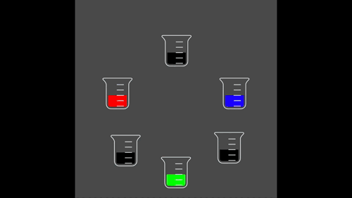

# HexColorMixer

Mix hex colors like you can in reality but don't because paint is expensive ;)

# Controls

Click and hold to drag. Shift + Click to Pour. 

# Live Demo

[View Live demo](https://regularmemory.blog/HexColorMix/)

# Example GIF

# Notes

- [ ] Ability to create new beaker with custom color, default empty
- [ ] Liquid wobble on drag
- [ ] Black beakers should be empty
- [ ] Beaker fill animation
