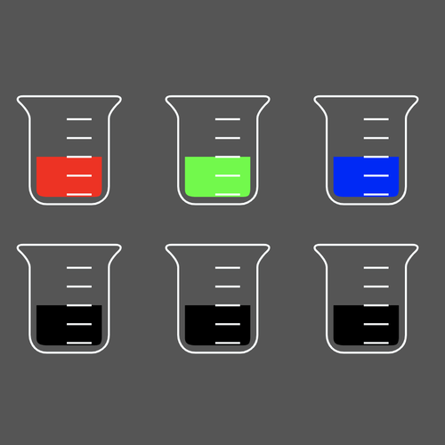

# HexColorMixer

Mix hex colors the way you can in reality, but don't because paint is too expensive :)

# Controls

Click and hold to drag. Shift + Click to Pour. 

# Demo

[Live demo](#)

# Screenshot

# Notes

- [ ] Ability to create new beaker with custom color, default empty
- [ ] Liquid wobble on drag
- [ ] Black beakers should be empty
- [ ] Beaker fill animation
